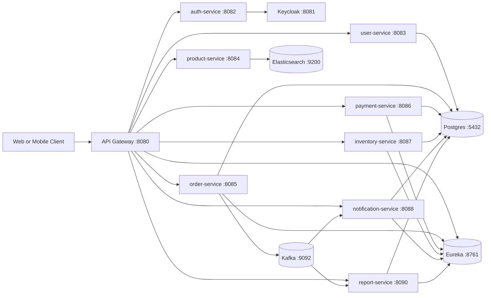
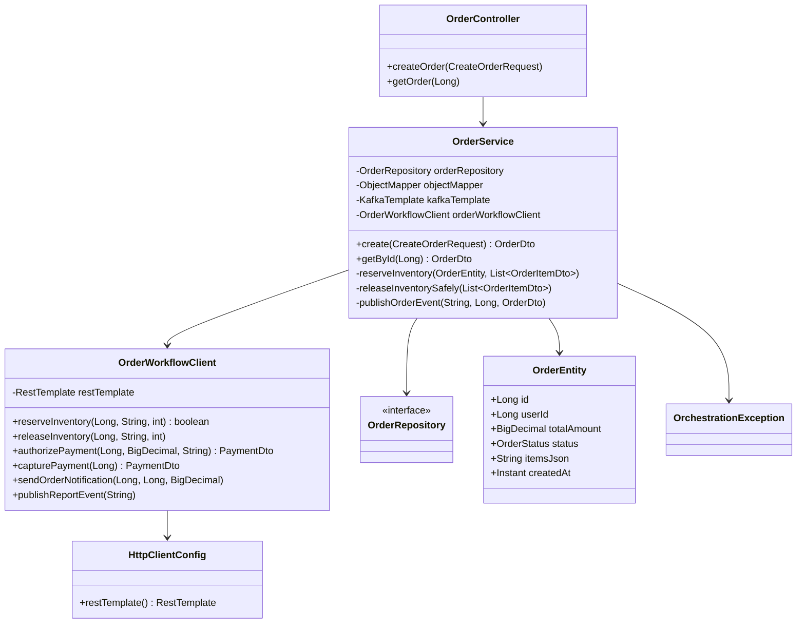
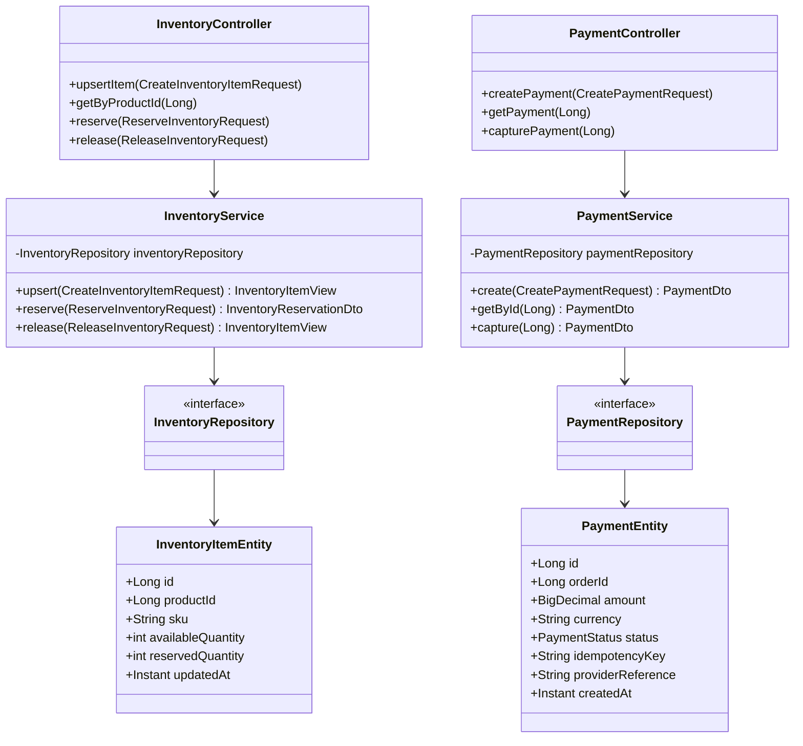
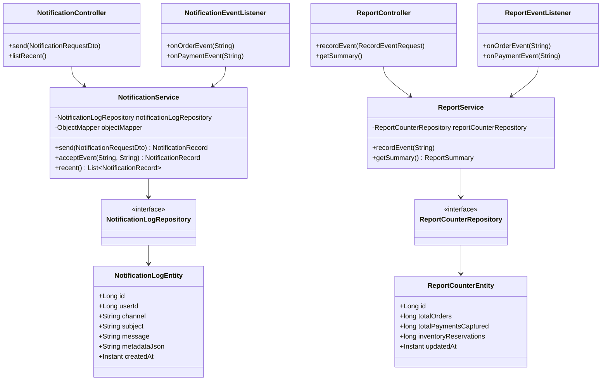
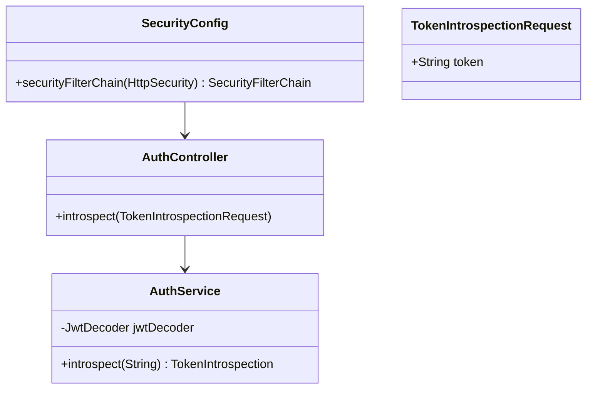

# Solution Architecture - Microservices Ecommerce

## 1) Purpose and Scope

This document describes the current solution architecture for the `microservices-ecommerce` platform, including:

- System context and service boundaries
- Runtime topology (local Docker + Kubernetes manifests)
- Data and integration architecture
- Class diagrams for key domains and orchestration paths
- Cross-cutting concerns (security, resilience, observability)
- Architecture risks and recommended next steps

The implementation references classes and configs currently in this repo.

## 2) Architectural Style

- **Style**: Distributed microservices with API Gateway + service discovery
- **Communication**:
  - Synchronous REST for request/response flows
  - Asynchronous Kafka events for decoupled consumers
- **Service discovery and client-side load balancing**:
  - Eureka server (`discovery-service`)
  - `lb://` routing in gateway and internal service calls
- **Data ownership**:
  - Database-per-service pattern (logical ownership, mostly Postgres)

## 3) System Context

## 4) Container and Runtime Topology

### 4.1 Runtime View (Local)

```mermaid
graph TB
    subgraph Infra[Docker Infrastructure]
      PG[(Postgres)]
      REDIS[(Redis)]
      KAFKA[(Kafka)]
      ES[(Elasticsearch)]
      KC[(Keycloak)]
      CH[(ClickHouse)]
    end

    subgraph App[Spring Boot Services]
      DS[discovery-service]
      GW[api-gateway]
      AUTH[auth-service]
      USER[user-service]
      PRODUCT[product-service]
      ORDER[order-service]
      PAYMENT[payment-service]
      INVENTORY[inventory-service]
      NOTIF[notification-service]
      ANALYTICS[analytics-service]
      REPORT[report-service]
    end

    GW --> DS
    AUTH --> DS
    USER --> DS
    PRODUCT --> DS
    ORDER --> DS
    PAYMENT --> DS
    INVENTORY --> DS
    NOTIF --> DS
    ANALYTICS --> DS
    REPORT --> DS

    USER --> PG
    ORDER --> PG
    PAYMENT --> PG
    INVENTORY --> PG
    NOTIF --> PG
    REPORT --> PG

    PRODUCT --> ES
    ORDER --> KAFKA
    NOTIF --> KAFKA
    REPORT --> KAFKA
    AUTH --> KC
```

### 4.2 Kubernetes (Current Manifest Coverage)

`infrastructure/k8s/kustomization.yaml` currently includes deploy/service resources for:

- `api-gateway`
- `user-service`
- `product-service`
- `order-service`

Other services are not yet fully represented in K8s manifests and should be added for production parity.

## 5) API and Integration Architecture

### 5.1 North-South API Entry

- External traffic enters through `api-gateway`
- Gateway routes by path to `lb://<service-name>` targets (Eureka resolved)
- Public API prefixes:
  - `/api/v1/auth/**`
  - `/api/v1/users/**`
  - `/api/v1/products/**`
  - `/api/v1/orders/**`
  - `/api/v1/inventory/**`
  - `/api/v1/payments/**`
  - `/api/v1/notifications/**`
  - `/api/v1/reports/**`

### 5.2 East-West Service Calls

Inside `order-service`, orchestration uses `OrderWorkflowClient` + `RestTemplate` with `@LoadBalanced` and calls:

- `inventory-service` reserve/release
- `payment-service` create/capture
- `notification-service` send notification
- `report-service` record event

### 5.3 Eventing

- `order-service` publishes `EventEnvelope<OrderDto>` to `orders.events`
- `notification-service` and `report-service` consume Kafka topics

## 6) Data Architecture

| Service | Primary Store | Notes |
|---|---|---|
| `user-service` | Postgres | User records |
| `order-service` | Postgres | Order header + item JSON |
| `payment-service` | Postgres | Payment + idempotency key |
| `inventory-service` | Postgres | Available and reserved quantities |
| `notification-service` | Postgres | Notification log history |
| `report-service` | Postgres | Aggregated counters |
| `product-service` | Elasticsearch | Product search/index |
| `auth-service` | Keycloak (external) | JWT validation/introspection |

## 7) Core Runtime Flows

Detailed sequence diagrams are in `FLOWS.md`. Core flow summary:

1. Client posts order to gateway
2. Gateway routes to `order-service`
3. `OrderService.create()` persists order in `CREATED`
4. Inventory reserve via `OrderWorkflowClient`
5. Payment authorize + capture
6. Order status moves to `PAID`
7. Kafka event published (`ORDER_PAID`)
8. Notification and report updates executed
9. On failure, compensation tries inventory release and order marked `FAILED`

## 8) Class Diagrams

### 8.1 Order Orchestration (Primary Use Case)

### 8.2 Inventory and Payment Domain Classes

### 8.3 Event Consumer and Reporting Classes

### 8.4 Auth and Security Classes

## 9) Cross-Cutting Concerns

### 9.1 Security

- Resource server setup in `auth-service` with JWT decode
- Issuer configured to Keycloak realm
- Gateway currently allows broad CORS (`*`) for development

### 9.2 Resilience

- Circuit breaker configured in gateway for `user`, `product`, and `order`
- Fallback endpoints implemented for degraded mode
- Compensation in `OrderService` performs best-effort inventory release

### 9.3 Observability

- Actuator endpoints enabled across services (`health`, `info`, `prometheus`)
- Prometheus and Grafana configs exist under `infrastructure/`
- ELK stack assets present for logs

### 9.4 Idempotency and Consistency

- Payment idempotency key prevents duplicate authorization rows
- Order orchestration uses local compensation, not full saga state machine
- Event delivery assumes at-least-once semantics; consumer idempotency should be hardened further

## 10) Deployment Architecture Notes

### 10.1 Local Development

- Infrastructure via `docker-compose.yml`
- Services run via Maven (`spring-boot:run`)
- Discovery-first startup recommended (`discovery-service` then dependents)

### 10.2 Kubernetes

- Kustomize base exists but covers only subset of services
- Recommended: add deployment/service resources for remaining services and infra dependencies

## 11) Architecture Risks and Improvement Backlog

1. **Workflow coupling in `order-service`**
   - Current orchestration is synchronous and service-coupled.
   - Improvement: explicit saga orchestration state + retries + DLQ.

2. **Partial circuit breaker coverage**
   - Only selected routes have circuit breakers.
   - Improvement: add for `payment`, `inventory`, `notification`, `report`, `auth`.

3. **Event schema governance**
   - Event contracts are lightweight and not schema-validated.
   - Improvement: versioned event schemas (Avro/JSON Schema) and compatibility checks.

4. **Auth production hardening**
   - Current auth service focuses on introspection endpoint.
   - Improvement: token exchange/client credentials/admin APIs if required.

5. **Kubernetes parity gap**
   - K8s manifests currently cover only key services.
   - Improvement: full platform manifests and environment overlays.

## 12) Document Index

- End-to-end runtime flows: `FLOWS.md`
- Startup and smoke commands: `README.md`
- Gateway routes and resilience config: `api-gateway/src/main/resources/application.yml`
- Infra composition: `docker-compose.yml`

