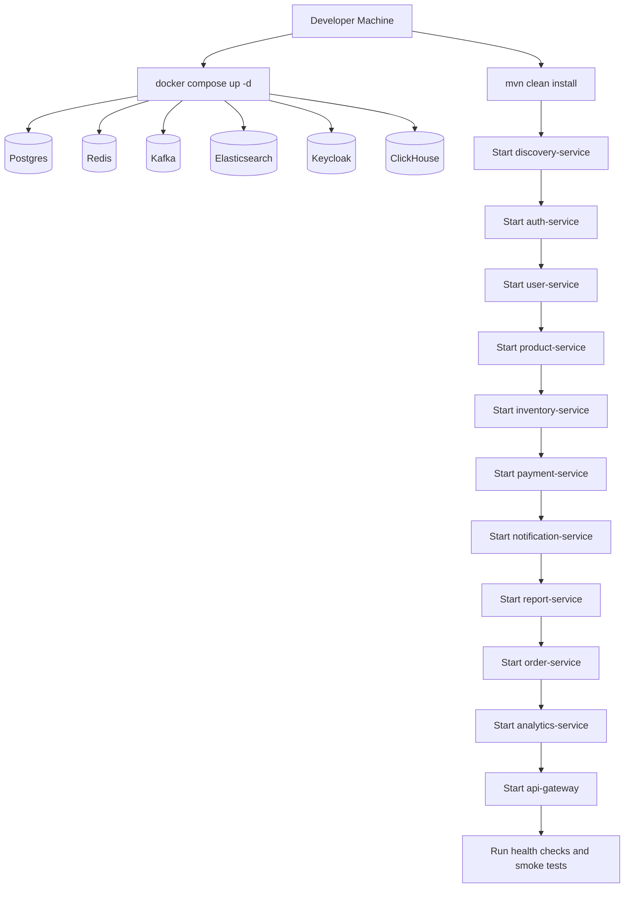

git# Deployment Flow Diagram

```mermaid
graph TB
	Dev[Developer Machine] --> DC[docker compose up -d]
	DC --> PG[(Postgres)]
	DC --> RD[(Redis)]
	DC --> KF[(Kafka)]
	DC --> ES[(Elasticsearch)]
	DC --> KC[(Keycloak)]
	DC --> CH[(ClickHouse)]

	Dev --> Build[mvn clean install]

	Build --> DS[Start discovery-service]
	DS --> S1[Start auth-service]
	S1 --> S2[Start user-service]
	S2 --> S3[Start product-service]
	S3 --> S4[Start inventory-service]
	S4 --> S5[Start payment-service]
	S5 --> S6[Start notification-service]
	S6 --> S7[Start report-service]
	S7 --> S8[Start order-service]
	S8 --> S9[Start analytics-service]
	S9 --> GW[Start api-gateway]

	GW --> Verify[Run health checks and smoke tests]
```

