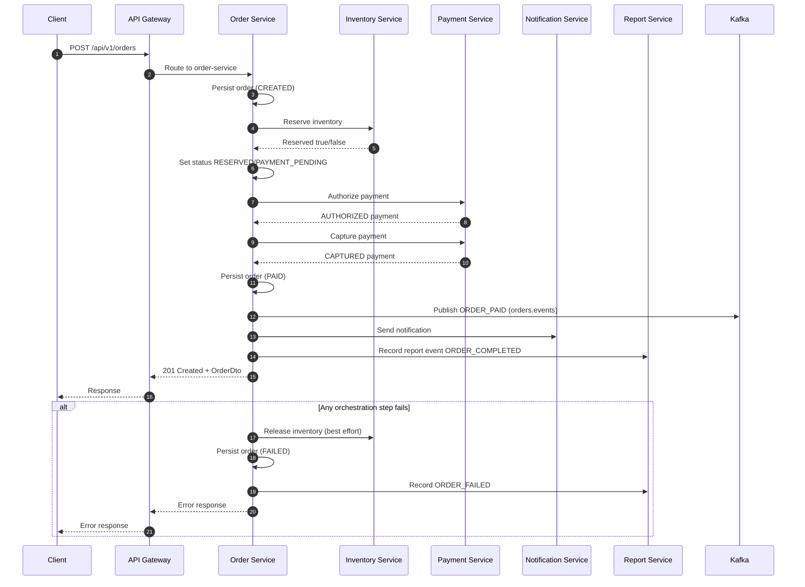

# Order Flow Sequence Diagram

```mermaid
sequenceDiagram
	autonumber
	participant C as Client
	participant G as API Gateway
	participant O as Order Service
	participant I as Inventory Service
	participant P as Payment Service
	participant N as Notification Service
	participant R as Report Service
	participant K as Kafka

	C->>G: POST /api/v1/orders
	G->>O: Route to order-service
	O->>O: Persist order (CREATED)
	O->>I: Reserve inventory
	I-->>O: Reserved true/false
	O->>O: Set status RESERVED/PAYMENT_PENDING
	O->>P: Authorize payment
	P-->>O: AUTHORIZED payment
	O->>P: Capture payment
	P-->>O: CAPTURED payment
	O->>O: Persist order (PAID)
	O->>K: Publish ORDER_PAID (orders.events)
	O->>N: Send notification
	O->>R: Record report event ORDER_COMPLETED
	O-->>G: 201 Created + OrderDto
	G-->>C: Response

	alt Any orchestration step fails
		O->>I: Release inventory (best effort)
		O->>O: Persist order (FAILED)
		O->>R: Record ORDER_FAILED
		O-->>G: Error response
		G-->>C: Error response
	end
```

