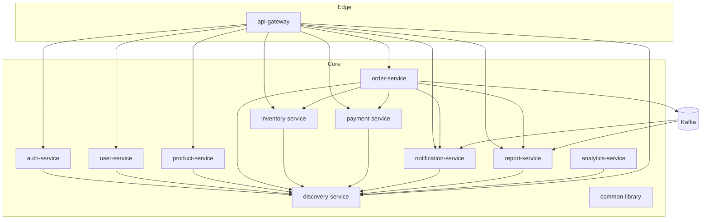

# Service Architecture Diagram

```mermaid
graph TB
	subgraph Edge
	  GW[api-gateway]
	end

	subgraph Core
	  AUTH[auth-service]
	  USER[user-service]
	  PROD[product-service]
	  ORD[order-service]
	  INV[inventory-service]
	  PAY[payment-service]
	  NOTIF[notification-service]
	  REP[report-service]
	  ANA[analytics-service]
	  DISC[discovery-service]
	  COMMON[common-library]
	end

	GW --> AUTH
	GW --> USER
	GW --> PROD
	GW --> ORD
	GW --> INV
	GW --> PAY
	GW --> NOTIF
	GW --> REP

	AUTH --> DISC
	USER --> DISC
	PROD --> DISC
	ORD --> DISC
	INV --> DISC
	PAY --> DISC
	NOTIF --> DISC
	REP --> DISC
	ANA --> DISC
	GW --> DISC

	ORD --> INV
	ORD --> PAY
	ORD --> NOTIF
	ORD --> REP

	ORD --> KAFKA[(Kafka)]
	KAFKA --> NOTIF
	KAFKA --> REP
```

