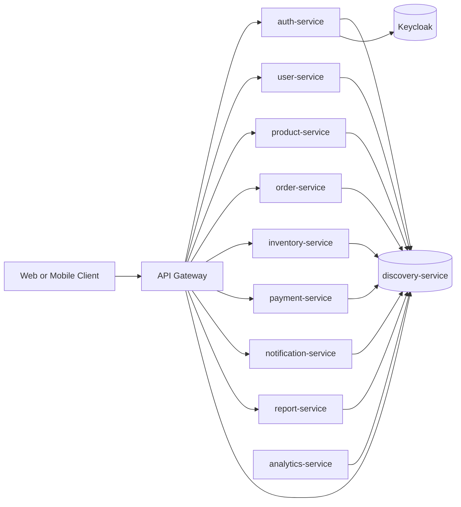

# System Context Diagram

```mermaid
graph LR
	Client[Web or Mobile Client] --> Gateway[API Gateway]
	Gateway --> Auth[auth-service]
	Gateway --> User[user-service]
	Gateway --> Product[product-service]
	Gateway --> Order[order-service]
	Gateway --> Inventory[inventory-service]
	Gateway --> Payment[payment-service]
	Gateway --> Notification[notification-service]
	Gateway --> Report[report-service]

	Gateway --> Eureka[(discovery-service)]
	Auth --> Eureka
	User --> Eureka
	Product --> Eureka
	Order --> Eureka
	Inventory --> Eureka
	Payment --> Eureka
	Notification --> Eureka
	Report --> Eureka
	Analytics[analytics-service] --> Eureka

	Auth --> Keycloak[(Keycloak)]
```

